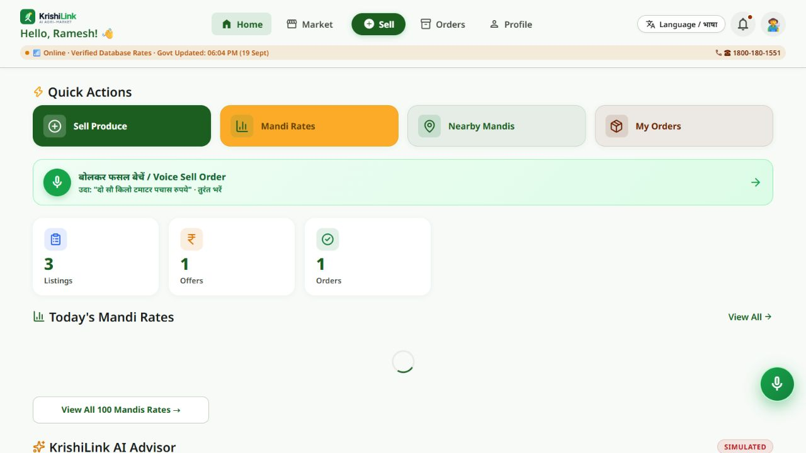
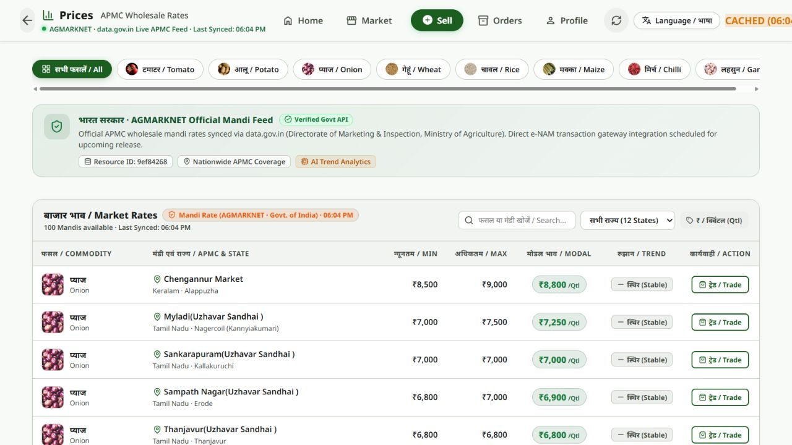
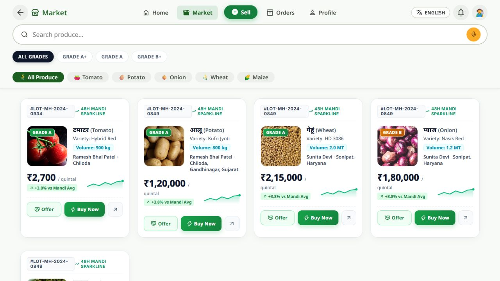
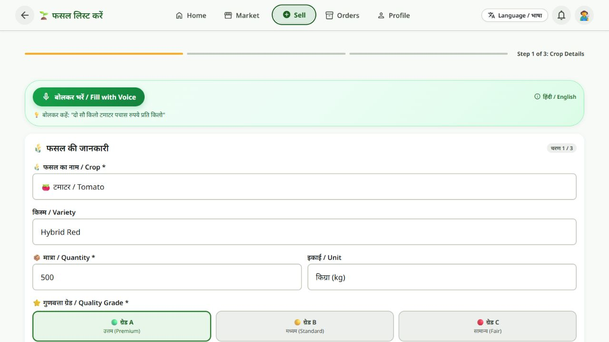

# 🌾 KrishiLink

### Agricultural market information, produce discovery, and voice-assisted selling.

KrishiLink is a farmer-focused web application built by **Team Astra X** for **Smart India Hackathon 2026 · PS 26132**. It brings mandi prices, produce listings, offers, and order workflows into one multilingual interface.

**[Open the live demo](https://krishilink-production.up.railway.app/app.html)**

> **Current status:** MVP / public demo. This README describes the checked-in HTML/CSS/JavaScript and Node.js implementation. Earlier Flutter/Dart and Python descriptions do not represent the current codebase.

## Try the demo

Select a demo account on the login screen, or use these published test credentials:

| Role | Phone | Password |
| --- | --- | --- |
| Farmer | `9876543210` | `farmer123` |
| Buyer | `9123456789` | `buyer123` |
| Admin | `9000000001` | `admin123` |

The public demo includes sample accounts, listings, and transactions. Its displayed values are demonstration data, not evidence of adoption or completed commercial activity.

## App screenshots

Captured from the live public farmer demo on **26 September 2026**. These are actual interface captures, not generated mockups. Market prices are snapshots; the captured feed reports cached data. Open an image to inspect it at full size.

### Farmer dashboard

Quick actions for selling produce, comparing mandi rates, and managing orders, with a voice-selling entry point.



### Mandi-price comparison

Crop and state filters with minimum, maximum, and modal wholesale prices, plus source/freshness indicators.



### Produce marketplace

Search and filter produce by crop and grade, inspect listing details, and access offer and purchase flows.



### Guided selling

The crop form captures variety, quantity, units, and quality grade, with voice-assisted input available.



## What the current application includes

- **Role-specific experiences:** farmer, buyer, and admin screens backed by profile and marketplace API routes.
- **Market information:** AGMARKNET/data.gov.in price retrieval, commodity/state filtering, and cached or fallback responses.
- **Produce workflows:** listings, incoming offers, order tracking, and notifications.
- **Guided selling:** a three-step listing form with crop, quantity, quality, and pricing fields.
- **Voice integration:** Gemini audio extraction, Whisper transcription fallback, Gemini text parsing, and a deterministic dictionary/regex fallback.
- **Language choices:** Hindi, English, Hinglish, Marathi, Punjabi, and Gujarati, using client-side translations. Some screens retain bilingual labels.
- **Payment integration code:** Razorpay order creation and signature verification, requiring configured credentials.

## Technology stack

| Layer | Current implementation |
| --- | --- |
| Frontend | HTML, CSS, vanilla JavaScript (`app.html`, `app.js`, `styles.css`, `data.js`) |
| Server | Node.js, Express 4, REST endpoints, `express-validator`, Multer |
| Database | PostgreSQL through `pg`, SQL migrations; optional PostGIS support |
| Cache | Redis through `ioredis`, with an in-memory cache fallback |
| Authentication / notifications | Firebase Admin token-verification and FCM integration, plus prototype login and development-mode paths |
| Market data | AGMARKNET via the data.gov.in Open Government Data API |
| Voice processing | Gemini audio/text APIs, OpenAI Whisper transcription, dictionary/regex fallback |
| Payments | Razorpay SDK and signature-verification endpoints |
| Deployment | Railway; Node 20 Dockerfile also included |

The repository does **not** currently contain a Flutter application, Dart frontend, or Python backend. Firebase is used for authentication/FCM integration, not as the marketplace database.

## Architecture

```text
Browser: app.html + app.js + styles.css
                 |
                 v
       Node.js / Express REST API
       /api/v1 (also /api alias)
                 |
       +---------+-----------+
       |                     |
 PostgreSQL / pg        Redis / ioredis
 profiles, listings,    cached market data
 offers, orders
       |
       +-- AGMARKNET / data.gov.in
       +-- Firebase Admin / FCM
       +-- Gemini / Whisper
       +-- Razorpay
```

The server serves the web frontend and API together. Market data uses cache, upstream API, database, and demo fallback paths. Database connectivity failures can activate an in-memory demo store; Redis failures use a process-local cache. These fallback stores are not durable persistence.

## Run locally

Use **Node.js 20** (matching the Dockerfile) and npm. For persistent data, provision PostgreSQL; Redis is optional because the cache has an in-memory fallback.

```sh
git clone https://github.com/souryajeet10/KrishiLink.git
cd KrishiLink
npm ci
```

Copy `.env.example` to `.env` using your editor or file manager. Set `DATABASE_URL` for your local database, and replace or omit placeholder integration credentials as appropriate. Do not commit `.env` or service-account keys.

For a configured local PostgreSQL database:

```sh
npm run migrate
npm run seed
npm start
```

Open **http://localhost:5173/app.html**. There is no separate frontend compilation step. `npm run dev` currently runs the same Node server as `npm start`; it does not enable hot reload.

Seeding populates demo data. Use a development database for these commands. The server also attempts migrations and demo seeding when a connected database has no produce listings.

### Configuration

See [`.env.example`](.env.example) for the template. Variables used by the current code include:

| Variables | Purpose |
| --- | --- |
| `PORT`, `NODE_ENV` | Server port and runtime environment; default port is 5173 |
| `DATABASE_URL` or `PGHOST`, `PGPORT`, `PGUSER`, `PGPASSWORD`, `PGDATABASE` | PostgreSQL connection |
| `PGSSL`, `PG_POOL_MAX` | Database TLS setting and pool sizing |
| `REDIS_URL`, `REDIS_CACHE_TTL` | Redis connection and cache lifetime |
| `GOOGLE_APPLICATION_CREDENTIALS` or `FIREBASE_PROJECT_ID`, `FIREBASE_CLIENT_EMAIL`, `FIREBASE_PRIVATE_KEY` | Firebase Admin service-account configuration |
| `FIREBASE_DEV_MODE` | Development/test token and messaging behavior |
| `DATA_GOV_IN_API_KEY`, `AGMARKNET_RESOURCE_ID` | Government mandi-price feed |
| `GEMINI_API_KEY`, `OPENAI_API_KEY` | Voice/audio parsing and transcription services |
| `RAZORPAY_KEY_ID`, `RAZORPAY_KEY_SECRET` | Razorpay integration; set both when enabling payments |

Not every integration is required to explore the prototype. Missing services may use documented fallbacks or leave their corresponding features unavailable. The example environment file includes placeholders, not usable credentials.

## Repository structure

```text
KrishiLink/
├── index.html                 # Landing page
├── app.html                   # Application screens
├── app.js                     # Browser interactions and API calls
├── styles.css                 # Interface styles
├── data.js                    # Client-side data and helpers
├── server.js                  # Express entry point and static hosting
├── src/
│   ├── config/                # PostgreSQL, Redis, Firebase, mock database
│   ├── controllers/           # Profiles, listings, offers, orders, etc.
│   ├── middlewares/           # Authentication, validation, error handling
│   ├── migrations/            # SQL migrations and demo seed
│   ├── routes/                # REST routes
│   ├── services/              # AGMARKNET, voice parsing, notifications
│   └── utils/                 # Pagination helpers
├── docs/screenshots/          # Captures of the public demo
├── test_*.js                  # API and workflow checks
├── .env.example
├── Dockerfile
├── railway.json
└── package.json
```

## Available checks

```sh
npm test
npm run test:api
npm run test:e2e
npm run test:razorpay
npm run test:voice
npm run migrate:status
```

Run workflow tests with development/test configuration and a disposable database: they exercise mutations such as creating listings, offers, and orders. Test commands are defined in `package.json`; their presence does not imply every external service has been verified on the public deployment.

## Deployment

The current public demo runs on Railway. [`railway.json`](railway.json) starts the application with `npm run migrate && npm start` and checks `/api/health`. The [`Dockerfile`](Dockerfile) uses Node 20 and serves the frontend and backend from the same process.

## Current limits and next steps

- The dashboard labels its advisor **SIMULATED**. It should not be presented as a validated predictive pricing model.
- Market responses can be live, cached, database-backed, or demo fallbacks. Check the source and timestamp shown in the UI.
- Direct **e-NAM transaction gateway** integration is described in the app as upcoming; it is not a completed integration.
- Authentication includes prototype password handling and development token fallbacks. Production authentication and authorization hardening remain necessary.
- Payment and voice integrations are implemented in source, but require service credentials and end-to-end validation. Real settlement was not tested for these screenshots.
- Further work includes durable behavior under service outages, broader regional-language testing, and low-connectivity support.

## Team and project context

**Team Astra X · Smart India Hackathon 2026 · Problem Statement 26132**

KrishiLink focuses on turning fragmented agricultural information into a more accessible farmer workflow.

## License

`package.json` declares ISC. A standalone license file has not yet been added to this repository.
